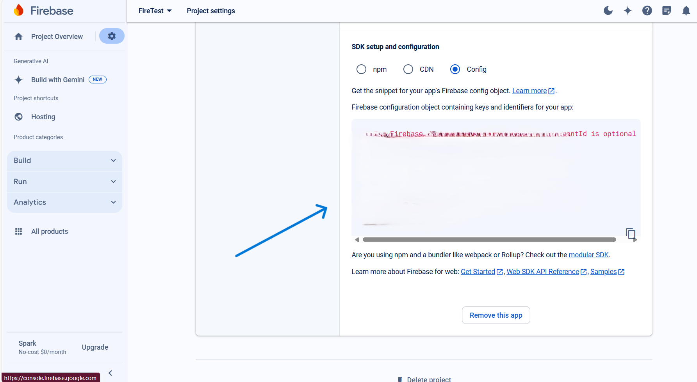
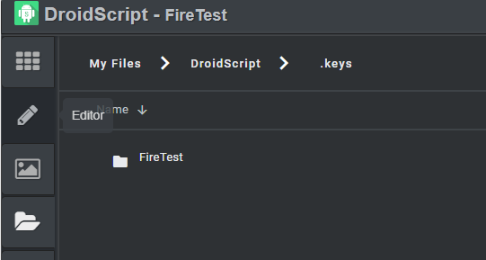
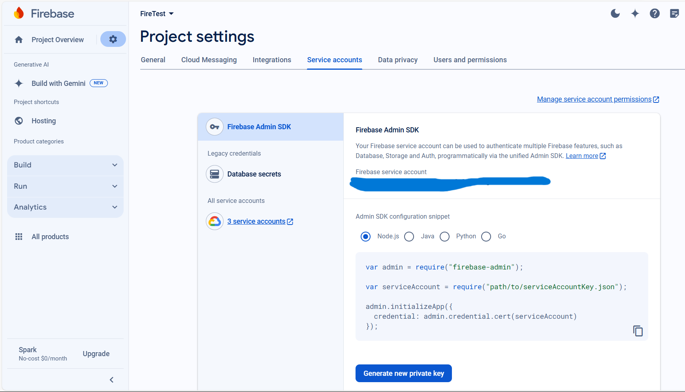
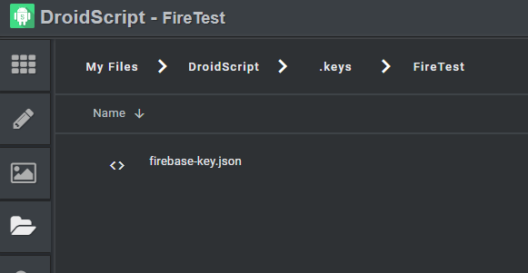

# DroidScript Firebase Extension

The first thing that you should have is a firebase project, and a node based DroidScript project.

## Firebase Set-up

The next step is to get your firebase key (the config), you should find this in the project settings, copy the config and create the file `firebase.json`.
It should be at the top level of your project, not in a subfolder.

Copy the json in that area, create a file called firebase.json


In your firebase.json code extend it to include the hosting object, the final thing should look like this :

```json
{
  "apiKey": "Something",
  "authDomain": "Something.com",
  "projectId": "someId",
  "storageBucket": "somebucket.appspot.com",
  "messagingSenderId": "12345678",
  "appId": "2;498u88943u894i",
  "measurementId": "Krfhr94893",
  "hosting": {
    "public": "public",
    "ignore": [
      "firebase.json",
      "**/.*",
      "**/node_modules/**"
    ],
    "rewrites": [
      {
        "source": "**",
        "destination": "/index.html"
      }
    ]
  }
}
```

The next step is to configure admin access, so move to the DroidScript folder, you should find folders like .edit, Extensions.

In the DroidScript folder add a new folder called `.keys`.
Then add a folder with the same name as your project.



In that folder add the file `firebase-key.json`, this file is not the same as the firebase.json file made earlier.



This file should have the service account json keys, click generate new private key, and a file will be downloaded, copy its contents and create firebase-key.json in the folder.



The last step is to create a public folder and add an index.html file, in your DroidScript project folder.

## Available Commands

1; !firebase deploy

Deploys your project, it will log the url to visit the deployment is the files in the public folder.

2; !firebase serv

It serves you static files in the public folder to port 5000
To visit type in the ip adress provided by DroidScript Wifi Ide, and change the 8088 port to 5000

i.e; 
DroidScript Ip is : http://192.168.1.181:8088/ change to : http://192.168.1.181:5000/

3; !firebase list

It lists all your projects.
